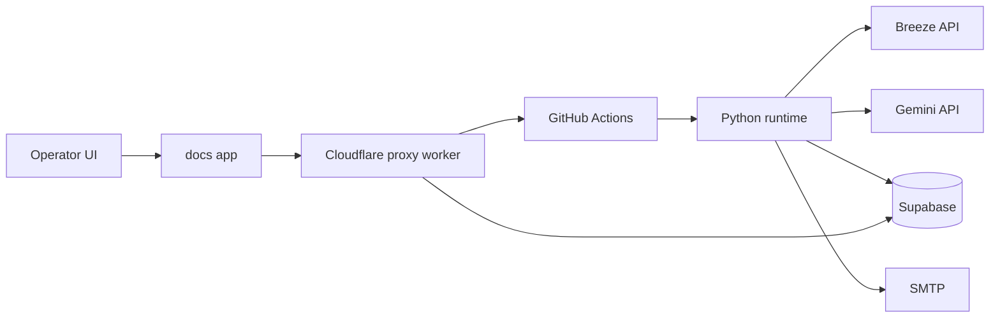
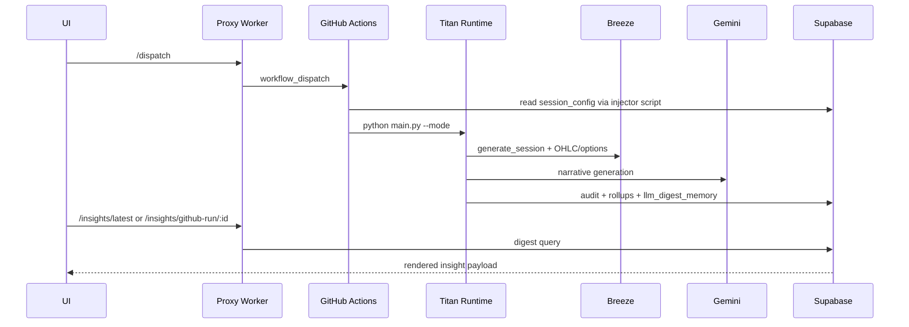

# Titan Framework Deep Dive

Code-grounded master document for the Titan repository: [arunurun/titan](https://github.com/arunurun/titan)

## 1) System Purpose and Scope

Titan is a Python-first market-analysis framework that combines:

- Breeze market data ingestion
- technical/tape scoring and guardrails
- Gemini narrative generation
- Supabase persistence for run history and digest memory
- GitHub Actions orchestration
- Cloudflare Worker proxy + static UI for mobile/operator control

Primary entrypoint:

- [`main.py`](https://github.com/arunurun/titan/blob/main/main.py)

Core runtime modules:

- [`src/sector_audit.py`](https://github.com/arunurun/titan/blob/main/src/sector_audit.py)
- [`src/breeze_client.py`](https://github.com/arunurun/titan/blob/main/src/breeze_client.py)
- [`src/analysis_store.py`](https://github.com/arunurun/titan/blob/main/src/analysis_store.py)
- [`src/brain.py`](https://github.com/arunurun/titan/blob/main/src/brain.py)

---

## 2) High-Level Architecture



Execution path:

1. UI dispatches a workflow through proxy.
2. Workflow injects token + env and runs `main.py`.
3. Runtime fetches Breeze data, computes analytics, generates digest.
4. Outputs persisted in Supabase and surfaced back via proxy insights endpoints.

---

## 3) Runtime Modes and Workflows

Mode selection lives in [`main.py`](https://github.com/arunurun/titan/blob/main/main.py).

Supported mode families:

- `--dry-run`
- `--live`
- `--sector <id>`
- `--all-sectors`
- `--protocol-run`
- `--custom-symbols`
- `--portfolio-holdings-json`

Protocol scheduling logic:

- [`src/protocol_runtime.py`](https://github.com/arunurun/titan/blob/main/src/protocol_runtime.py)
- [`src/protocol_loop.py`](https://github.com/arunurun/titan/blob/main/src/protocol_loop.py)
- [`scripts/run_protocol_loop.py`](https://github.com/arunurun/titan/blob/main/scripts/run_protocol_loop.py)

Primary workflows:

- [`run_titan_now.yml`](https://github.com/arunurun/titan/blob/main/.github/workflows/run_titan_now.yml)
- [`market_audit.yml`](https://github.com/arunurun/titan/blob/main/.github/workflows/market_audit.yml)
- [`refresh_sector_rankings_weekly.yml`](https://github.com/arunurun/titan/blob/main/.github/workflows/refresh_sector_rankings_weekly.yml)
- [`validate_breeze_token_manual.yml`](https://github.com/arunurun/titan/blob/main/.github/workflows/validate_breeze_token_manual.yml)
- [`persist_breeze_token_manual.yml`](https://github.com/arunurun/titan/blob/main/.github/workflows/persist_breeze_token_manual.yml)

---

## 4) End-to-End Data Flow



Persistence and retrieval glue:

- write audit logs: [`src/supabase_log.py`](https://github.com/arunurun/titan/blob/main/src/supabase_log.py)
- write analytics/digest memory: [`src/analysis_store.py`](https://github.com/arunurun/titan/blob/main/src/analysis_store.py)
- proxy insight routes: [`proxy/cloudflare-worker.js`](https://github.com/arunurun/titan/blob/main/proxy/cloudflare-worker.js)

---

## 5) File-by-File Catalog (Key Files)

## 5.1 `src/`

- [`src/config_loader.py`](https://github.com/arunurun/titan/blob/main/src/config_loader.py): loads env, parses Gemini keys, builds `TitanConfig`.
- [`src/breeze_session_auth.py`](https://github.com/arunurun/titan/blob/main/src/breeze_session_auth.py): parse/validate Breeze token and update `.env`.
- [`src/breeze_client.py`](https://github.com/arunurun/titan/blob/main/src/breeze_client.py): Breeze session creation and market data fetch with retries/rate controls.
- [`src/breeze_scrip_master.py`](https://github.com/arunurun/titan/blob/main/src/breeze_scrip_master.py): symbol-to-stock-code mapping cache.
- [`src/titan_engine.py`](https://github.com/arunurun/titan/blob/main/src/titan_engine.py): technical score primitives (EMA, ATR, ADX, CMF, OBV, z-score).
- [`src/sector_registry.py`](https://github.com/arunurun/titan/blob/main/src/sector_registry.py): load sector instruments from Supabase or CSV fallback.
- [`src/sector_audit.py`](https://github.com/arunurun/titan/blob/main/src/sector_audit.py): central sector pipeline and digest generation.
- [`src/analysis_store.py`](https://github.com/arunurun/titan/blob/main/src/analysis_store.py): writes run metadata, symbol features, rollups, LLM memory.
- [`src/supabase_log.py`](https://github.com/arunurun/titan/blob/main/src/supabase_log.py): writes `audit_logs`.
- [`src/brain.py`](https://github.com/arunurun/titan/blob/main/src/brain.py): Gemini generation, key rotation, compliance-aware retries.
- [`src/compliance.py`](https://github.com/arunurun/titan/blob/main/src/compliance.py): forbidden terms scanning.
- [`src/email_notify.py`](https://github.com/arunurun/titan/blob/main/src/email_notify.py): SMTP success/failure/action emails.
- [`src/action_signals.py`](https://github.com/arunurun/titan/blob/main/src/action_signals.py): action signal normalization and interpretation.
- [`src/tape_metrics.py`](https://github.com/arunurun/titan/blob/main/src/tape_metrics.py): return/notional/percentile helpers.
- [`src/sector_priority.py`](https://github.com/arunurun/titan/blob/main/src/sector_priority.py): ranking + winners persistence.
- [`src/portfolio_analysis.py`](https://github.com/arunurun/titan/blob/main/src/portfolio_analysis.py): holdings parsing and per-position analysis.

**V12 news pipeline (per-symbol):** `news_client` fetches from NewsAPI, Finnhub, and RSS; `news_sentiment` scores headlines (VADER by default); `news_store` persists to `news_feed` / `symbol_news_snapshots` in Supabase; `news_audit` correlates sentiment with price moves. `sector_audit._enrich_audit_with_symbol_news` attaches `recent_news` and sentiment fields to each equity audit without blocking the run on fetch failures (`news_error` is recorded instead). Macro sector news for digest lines remains in `sector_priority` via `global_news_snapshots`. Scheduled batch fetch: `scripts/fetch_news_batch.py` and `.github/workflows/news_fetch.yml`.
- [`src/custom_equity_resolution.py`](https://github.com/arunurun/titan/blob/main/src/custom_equity_resolution.py): free-form hint to canonical symbol resolution.
- [`src/market_calendar.py`](https://github.com/arunurun/titan/blob/main/src/market_calendar.py): holiday/weekend gating.
- [`src/json_util.py`](https://github.com/arunurun/titan/blob/main/src/json_util.py): sanitize JSON-unfriendly floats.

## 5.2 `scripts/`

- [`scripts/breeze_session.py`](https://github.com/arunurun/titan/blob/main/scripts/breeze_session.py): local Breeze session acquisition flow.
- [`scripts/persist_breeze_token_to_supabase.py`](https://github.com/arunurun/titan/blob/main/scripts/persist_breeze_token_to_supabase.py): validates and stores token in Supabase.
- [`scripts/validate_breeze_token_from_supabase.py`](https://github.com/arunurun/titan/blob/main/scripts/validate_breeze_token_from_supabase.py): tests stored token and alerts on failure.
- [`scripts/fetch_breeze_session_from_supabase.py`](https://github.com/arunurun/titan/blob/main/scripts/fetch_breeze_session_from_supabase.py): prints stored token for shell usage.
- [`scripts/inject_breeze_session_from_supabase.py`](https://github.com/arunurun/titan/blob/main/scripts/inject_breeze_session_from_supabase.py): CI injector to `GITHUB_ENV`.
- [`scripts/emit_breeze_api_key_for_wrangler.py`](https://github.com/arunurun/titan/blob/main/scripts/emit_breeze_api_key_for_wrangler.py): secret helper for Wrangler.
- [`scripts/run_protocol_loop.py`](https://github.com/arunurun/titan/blob/main/scripts/run_protocol_loop.py): lockfile-based continuous protocol loop.
- [`scripts/run_live.cmd`](https://github.com/arunurun/titan/blob/main/scripts/run_live.cmd): Windows live run helper.
- [`scripts/refresh_all_sector_rankings.py`](https://github.com/arunurun/titan/blob/main/scripts/refresh_all_sector_rankings.py): all-sector ranking refresh.
- [`scripts/refresh_sector_priority_rankings.py`](https://github.com/arunurun/titan/blob/main/scripts/refresh_sector_priority_rankings.py): sector ranking refresh.
- [`scripts/refresh_sector_daily_winners.py`](https://github.com/arunurun/titan/blob/main/scripts/refresh_sector_daily_winners.py): top winners persistence.
- [`scripts/curate_ai_sector.py`](https://github.com/arunurun/titan/blob/main/scripts/curate_ai_sector.py): strict AI-sector curation.
- [`scripts/curate_sector_strict.py`](https://github.com/arunurun/titan/blob/main/scripts/curate_sector_strict.py): strict generic sector curation.
- [`scripts/backfill_sector_registry_from_csv.py`](https://github.com/arunurun/titan/blob/main/scripts/backfill_sector_registry_from_csv.py): registry bootstrap from CSV.

## 5.3 `proxy/`

- [`proxy/cloudflare-worker.js`](https://github.com/arunurun/titan/blob/main/proxy/cloudflare-worker.js): tokenless dispatch/read API, insights/news endpoints.
- [`proxy/titan_ui_worker.js`](https://github.com/arunurun/titan/blob/main/proxy/titan_ui_worker.js): static worker serving `docs/`.

## 5.4 `docs/`

- [`docs/index.html`](https://github.com/arunurun/titan/blob/main/docs/index.html): control UI shell.
- [`docs/app.js`](https://github.com/arunurun/titan/blob/main/docs/app.js): workflow dispatch + run polling + input guards.
- [`docs/insights.html`](https://github.com/arunurun/titan/blob/main/docs/insights.html): insights page.
- [`docs/digest-render.js`](https://github.com/arunurun/titan/blob/main/docs/digest-render.js): digest UI renderer.
- [`docs/TITAN_BUILD_AND_DEPLOY.md`](https://github.com/arunurun/titan/blob/main/docs/TITAN_BUILD_AND_DEPLOY.md): deployment guide.
- [`docs/PROXY_SETUP.md`](https://github.com/arunurun/titan/blob/main/docs/PROXY_SETUP.md): proxy setup details.

## 5.5 `.github/workflows/`

- [`run_titan_now.yml`](https://github.com/arunurun/titan/blob/main/.github/workflows/run_titan_now.yml): manual mode dispatch.
- [`market_audit.yml`](https://github.com/arunurun/titan/blob/main/.github/workflows/market_audit.yml): scheduled audits and token-failure handling.
- [`refresh_sector_rankings_weekly.yml`](https://github.com/arunurun/titan/blob/main/.github/workflows/refresh_sector_rankings_weekly.yml): weekly rankings.
- [`persist_breeze_token_manual.yml`](https://github.com/arunurun/titan/blob/main/.github/workflows/persist_breeze_token_manual.yml): manual token persist.
- [`validate_breeze_token_manual.yml`](https://github.com/arunurun/titan/blob/main/.github/workflows/validate_breeze_token_manual.yml): manual token check.
- [`android-twa-apk.yml`](https://github.com/arunurun/titan/blob/main/.github/workflows/android-twa-apk.yml): Android TWA build.

## 5.6 `sql/`

- [`sql/create_session_config.sql`](https://github.com/arunurun/titan/blob/main/sql/create_session_config.sql): token table.
- [`sql/ensure_session_config_row.sql`](https://github.com/arunurun/titan/blob/main/sql/ensure_session_config_row.sql): ensure single-row token record.
- [`sql/create_audit_logs.sql`](https://github.com/arunurun/titan/blob/main/sql/create_audit_logs.sql): audit table.
- [`sql/fix_audit_logs_rls.sql`](https://github.com/arunurun/titan/blob/main/sql/fix_audit_logs_rls.sql): audit RLS adjustments.
- [`sql/create_sector_registry_tables.sql`](https://github.com/arunurun/titan/blob/main/sql/create_sector_registry_tables.sql): sector/instrument registry.
- [`sql/create_analysis_rollups.sql`](https://github.com/arunurun/titan/blob/main/sql/create_analysis_rollups.sql): run+feature+rollup schema.
- [`sql/alter_symbol_daily_features_add_tape_extras.sql`](https://github.com/arunurun/titan/blob/main/sql/alter_symbol_daily_features_add_tape_extras.sql): extended features.
- [`sql/alter_llm_digest_memory_add_full_digest.sql`](https://github.com/arunurun/titan/blob/main/sql/alter_llm_digest_memory_add_full_digest.sql): full digest field.
- [`sql/alter_llm_digest_memory_add_github_run_id.sql`](https://github.com/arunurun/titan/blob/main/sql/alter_llm_digest_memory_add_github_run_id.sql): workflow-run linkage.
- [`sql/grant_llm_digest_memory.sql`](https://github.com/arunurun/titan/blob/main/sql/grant_llm_digest_memory.sql): grants.
- [`sql/create_sector_priority_rankings.sql`](https://github.com/arunurun/titan/blob/main/sql/create_sector_priority_rankings.sql): rankings table.
- [`sql/create_sector_daily_winners.sql`](https://github.com/arunurun/titan/blob/main/sql/create_sector_daily_winners.sql): winners table.

## 5.7 `tests/`

- [`tests/test_main_cli.py`](https://github.com/arunurun/titan/blob/main/tests/test_main_cli.py)
- [`tests/test_sector_audit.py`](https://github.com/arunurun/titan/blob/main/tests/test_sector_audit.py)
- [`tests/test_breeze_client.py`](https://github.com/arunurun/titan/blob/main/tests/test_breeze_client.py)
- [`tests/test_breeze_session_auth.py`](https://github.com/arunurun/titan/blob/main/tests/test_breeze_session_auth.py)
- [`tests/test_persist_breeze_token_to_supabase.py`](https://github.com/arunurun/titan/blob/main/tests/test_persist_breeze_token_to_supabase.py)
- [`tests/test_validate_breeze_token_from_supabase.py`](https://github.com/arunurun/titan/blob/main/tests/test_validate_breeze_token_from_supabase.py)
- [`tests/test_inject_session.py`](https://github.com/arunurun/titan/blob/main/tests/test_inject_session.py)
- [`tests/test_protocol_runtime.py`](https://github.com/arunurun/titan/blob/main/tests/test_protocol_runtime.py)
- [`tests/test_protocol_loop.py`](https://github.com/arunurun/titan/blob/main/tests/test_protocol_loop.py)
- [`tests/test_analysis_store.py`](https://github.com/arunurun/titan/blob/main/tests/test_analysis_store.py)
- [`tests/test_supabase_log.py`](https://github.com/arunurun/titan/blob/main/tests/test_supabase_log.py)
- [`tests/test_portfolio_analysis.py`](https://github.com/arunurun/titan/blob/main/tests/test_portfolio_analysis.py)

---

## 6) Supabase Schema Usage Map

| Table | Role | Main references |
|---|---|---|
| `session_config` | Breeze token persistence | token scripts, portfolio path |
| `audit_logs` | run audit payloads | `src/supabase_log.py` |
| `sector_catalog` | sector definitions | `src/sector_registry.py`, curation scripts |
| `market_instruments` | instrument universe | provider sync + curation |
| `instrument_sector_map` | instrument/sector relation | sector registry reads |
| `sector_overrides` | explicit mapping overrides | curation/sync logic |
| `scanner_runs` | sync run metadata | provider sync |
| `run_metadata` | per-run top-level stats | `src/analysis_store.py` |
| `symbol_daily_features` | per-symbol features | `src/analysis_store.py` |
| `sector_daily_rollup` | daily aggregate | `src/analysis_store.py` |
| `sector_period_rollup` | 7/15/30d aggregate | `src/analysis_store.py` |
| `llm_digest_memory` | digest + full payload + run link | analysis store + proxy insights |
| `sector_priority_rankings` | ranking outputs | `src/sector_priority.py` |
| `sector_daily_winners` | winner snapshots | ranking scripts |

Provisioning order recommendation:

1. `create_session_config.sql`
2. `create_audit_logs.sql`
3. `create_sector_registry_tables.sql`
4. `create_analysis_rollups.sql`
5. alter scripts (`symbol_daily_features`, `llm_digest_memory`)
6. `create_sector_priority_rankings.sql`
7. `create_sector_daily_winners.sql`
8. grants/fixes scripts

---

## 7) Secrets/Tokens Matrix

| Name | Source | Purpose | Consumers | Rotation guidance |
|---|---|---|---|---|
| `BREEZE_SESSION_TOKEN` | Env or Supabase `session_config` | session auth | injector + runtime | refresh on expiry, keep stores synchronized |
| `BREEZE_API_KEY` | env secret | Breeze identity/login URL | runtime + worker | rotate per broker credential policy |
| `BREEZE_SECRET` | env secret | session generation | runtime + token validators | high sensitivity, rotate with account changes |
| `SUPABASE_URL` | env secret | API endpoint | scripts/runtime/worker | update globally when project changes |
| `SUPABASE_KEY` | env secret | DB/API auth | runtime/scripts | prefer service-role for server writes |
| `SUPABASE_SERVICE_ROLE_KEY` | worker/automation secret | privileged Supabase access | proxy, provider sync | never expose client-side |
| `GEMINI_API_KEY` (+ `_2..5`, list) | env secret | LLM generation | `src/brain.py` | rotate for quota/auth events |
| `GITHUB_PAT` | proxy secret | workflow dispatch/read | proxy worker | use minimal scopes, rotate periodically |
| `SMTP_*`, `EMAIL_*` | env secrets | alerts and run notifications | `src/email_notify.py` | rotate mailbox creds and test after updates |
| `BREEZE_TOKEN_UPDATOR_PAT` | workflow secret | trigger external updater repo | `market_audit.yml` | keep repo dispatch rights current |

Key precedence rules:

- `inject_breeze_session_from_supabase.py`: existing `BREEZE_SESSION_TOKEN` env wins; fallback is Supabase.
- `load_dotenv(..., override=False)` means existing process env values beat `.env`.
- `portfolio_analysis.py` attempts Supabase token lookup for runtime replacement if available.

---

## 8) Breeze Token Lifecycle (Detailed)

## 8.1 Acquire

- Local flow: [`scripts/breeze_session.py`](https://github.com/arunurun/titan/blob/main/scripts/breeze_session.py)
- Manual CI flow: [`persist_breeze_token_manual.yml`](https://github.com/arunurun/titan/blob/main/.github/workflows/persist_breeze_token_manual.yml)

## 8.2 Parse + validate

- Parser: `parse_api_session_from_input()` in [`src/breeze_session_auth.py`](https://github.com/arunurun/titan/blob/main/src/breeze_session_auth.py)
- Shape validator rejects empty/newline/quoted/short tokens.
- Functional validator uses Breeze `generate_session`.

## 8.3 Store

- Supabase table: `session_config`
- Writer script: [`scripts/persist_breeze_token_to_supabase.py`](https://github.com/arunurun/titan/blob/main/scripts/persist_breeze_token_to_supabase.py)

## 8.4 Inject

- CI injector: [`scripts/inject_breeze_session_from_supabase.py`](https://github.com/arunurun/titan/blob/main/scripts/inject_breeze_session_from_supabase.py)
- Writes `BREEZE_SESSION_TOKEN` to `GITHUB_ENV`.

## 8.5 Consume

- Runtime creation: [`src/breeze_client.py`](https://github.com/arunurun/titan/blob/main/src/breeze_client.py)
- Used by live/sector/portfolio/ranking flows.

## 8.6 Validate + refresh

- Validator script: [`scripts/validate_breeze_token_from_supabase.py`](https://github.com/arunurun/titan/blob/main/scripts/validate_breeze_token_from_supabase.py)
- If invalid, alert email path is triggered.
- `market_audit.yml` has fallback dispatch path to external updater repo.

Breeze troubleshooting checklist:

- [ ] token has no quotes/newlines
- [ ] `session_config(id=1)` exists and is recent
- [ ] injector step wrote env values
- [ ] runtime saw expected source marker
- [ ] `BREEZE_API_KEY` + `BREEZE_SECRET` are valid

---

## 9) Deployment Model

Proxy:

- config: [`wrangler.toml`](https://github.com/arunurun/titan/blob/main/wrangler.toml)
- code: [`proxy/cloudflare-worker.js`](https://github.com/arunurun/titan/blob/main/proxy/cloudflare-worker.js)

UI worker:

- config: [`wrangler.titan-ui.toml`](https://github.com/arunurun/titan/blob/main/wrangler.titan-ui.toml)
- code: [`proxy/titan_ui_worker.js`](https://github.com/arunurun/titan/blob/main/proxy/titan_ui_worker.js)
- assets served from `docs/`

CI/CD:

- workflows in `.github/workflows/` run Python runtime and token injector

Android:

- TWA workflow: [`android-twa-apk.yml`](https://github.com/arunurun/titan/blob/main/.github/workflows/android-twa-apk.yml)
- assetlinks: [`docs/.well-known/assetlinks.json`](https://github.com/arunurun/titan/blob/main/docs/.well-known/assetlinks.json)

---

## 10) Rebuild from Scratch Runbook

## 10.1 Bootstrap

```bash
git clone https://github.com/arunurun/titan.git
cd titan
python -m venv .venv
. .venv/Scripts/Activate.ps1
pip install -r requirements.txt
npm install
```

## 10.2 Configure `.env`

Populate:

- Breeze creds + token
- Supabase URL/key
- Gemini keys
- SMTP/email vars (optional but recommended)

## 10.3 Apply SQL

Apply SQL files in section 6 order.

## 10.4 Seed/curate universe

```bash
python scripts/backfill_sector_registry_from_csv.py
python scripts/refresh_all_sector_rankings.py --top-n 10
```

## 10.5 Validate and run

```bash
python scripts/validate_breeze_token_from_supabase.py
python main.py --dry-run
python main.py --sector defence --sector-digest
```

## 10.6 Deploy workers

```bash
npx wrangler deploy
npx wrangler deploy -c wrangler.titan-ui.toml
```

## 10.7 Sync deep-dive markdown to Google Doc

Required one-time setup:

1. Create a Google Cloud service account and download its JSON key.
2. Enable the Google Docs API in the same Google Cloud project.
3. Share the target Google Doc with the service account email (Editor access).
4. Set these environment variables:
   - `GOOGLE_DOC_ID`: target Google Doc ID.
   - `GOOGLE_SERVICE_ACCOUNT_JSON`: path to the JSON key file.
   - `TITAN_DOC_SOURCE_PATH` (optional): markdown source path override.

One-command sync (full replace):

```bash
python scripts/sync_markdown_to_gdoc.py
```

Dry-run validation (no API writes):

```bash
python scripts/sync_markdown_to_gdoc.py --dry-run
```

Optional append mode:

```bash
python scripts/sync_markdown_to_gdoc.py --append
```

Smoke checklist:

- [ ] proxy `/health` works
- [ ] workflow dispatch from UI works
- [ ] run persists `llm_digest_memory`
- [ ] insights endpoint resolves latest and by run ID

---

## 11) Ops Troubleshooting Runbook

### Token expired / invalid

- Run `scripts/validate_breeze_token_from_supabase.py`
- Acquire new token via `scripts/breeze_session.py`
- Persist via manual workflow or script
- Re-run validation and then target workflow

### Supabase missing table / schema mismatch

- Apply missing `create_*`/`alter_*` scripts
- Ensure `llm_digest_memory` has `full_digest` and `github_run_id`
- Ensure write-capable key is used by runtime

### Insights empty

- Confirm `TITAN_ENABLE_ANALYSIS_STORE=1`
- Confirm run persisted digest rows for sector + run id
- Confirm proxy has Supabase secrets configured

### Proxy dispatch/auth failures

- Rotate/check `GITHUB_PAT`
- Verify `REPO_OWNER`, `REPO_NAME`
- Validate allowed workflow names in proxy code

### Gemini 429/quota failures

- Configure multiple keys (`GEMINI_API_KEYS` or suffix vars)
- Keep fail-open digest behavior enabled when needed

---

## 12) Critical Additional Components

- `control_ui/`: local Flask operations panel. [app.py](https://github.com/arunurun/titan/blob/main/control_ui/app.py)
- `provider-universe-sync/`: weekly universe sync into Supabase. [main](https://github.com/arunurun/titan/blob/main/provider-universe-sync/src/main.py)
- `breeze-token-updator/`: separate token validation/alert project. [validator](https://github.com/arunurun/titan/blob/main/breeze-token-updator/src/validate_token.py)

---

## 13) Assumptions and Gaps

Not fully inferable from repository code:

- real production secret values and rotation schedule
- exact live domain routing and account-level Cloudflare/Supabase configuration
- production accuracy/PnL evaluation metrics beyond code-level scoring logic
- external provider SLA/policy changes (Breeze/Gemini) outside code control

Workflow/lint/build command caveat:

- Repository exposes scripts and workflows, but no single unified lint/build command contract is explicitly defined as a mandatory pipeline command in the root docs.

---

## 14) May 2026 Digest Template Updates

- Deterministic tick rules now apply across all key insight lines in sector digest symbol blocks.
- Tape snapshot and sector-relative rank headers now carry deterministic section ticks derived from underlying metrics.
- Tape and rank metric lines now show stable tick icons using fixed thresholds (not LLM narration).
- Global news correlation is now always emitted for each sector symbol block.
- When direct sector news matches are sparse or missing, Titan falls back to the best available global/local market driver with reduced confidence and an explicit `fallback=` label.
- Fallback wording is intentionally explicit about source quality to avoid overstating confidence or fabricating sector-specific causality.

