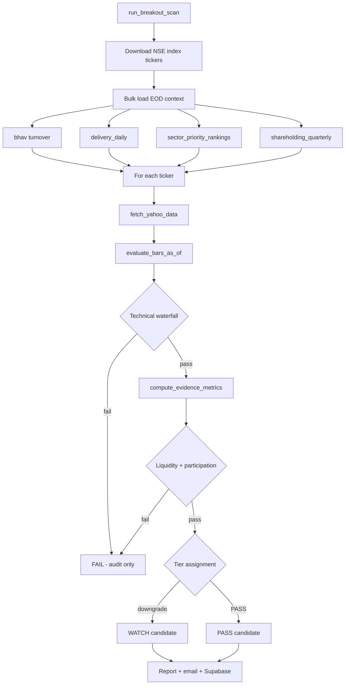

# Breakout Scanner — Logic Reference

This document describes the **live** small- and micro-cap breakout scanner as wired on `main` (PR #13). Entry point: `run_breakout_scan` in `src/breakout_scanner.py`. Evaluation core: `evaluate_bars_as_of`. Evidence scoring: `src/breakout_evidence.py`. EOD enrichment: `src/breakout_eod_context.py`, `src/breakout_sector_context.py`.

**Scope**

- Universes: Nifty Smallcap 100 (~100 names) and Nifty Microcap 250 (~250 names).
- Point-in-time: all bar metrics use history through signal day **T** (`as_of_idx`); pre-filters use **T−1** and earlier only.
- Output tiers: **PASS**, **WATCH**, **PRE_BREAKOUT** (SETUP), or **FAIL**. Candidates include PASS, WATCH, and capped PRE_BREAKOUT rows.

---

## Data sources

| Source | Module / path | Used for |
|--------|---------------|----------|
| NSE index CSVs | `INDEX_URLS` in `breakout_scanner.py` | Universe tickers (`SYMBOL.NS`) |
| Supabase `equity_ohlcv_daily` | `breakout_ohlcv_store.load_ohlcv_from_supabase` | ~1y daily OHLCV when warm (min 50 bars, last bar within 3 trading days) |
| Yahoo Finance chart API | `fetch_yahoo_data` | ~1y daily OHLCV fallback (min 50 bars) |
| On-disk Yahoo cache | `data/cache/breakout_yahoo/{ticker}_{YYYYMMDD}.json` | Rate-limit relief when Supabase miss/stale |
| Bhav copy cache | `temp/nse_cache/sec_bhavdata_full_*.csv` | Avg turnover (lacs); delivery fallback |
| Supabase `delivery_daily` | `load_delivery_pct_by_symbol` | Trailing avg delivery % |
| Supabase `shareholding_quarterly` | `load_free_float_pct_by_symbol` | Free-float % for liquidity quality |
| Supabase `sector_priority_rankings` | `load_sector_lead_scores` | Sector leadership score for composite rank |
| Supabase `breakout_stock_analysis` | `persist_breakout_stock_analysis` | Per-run audit rows (optional) |
| ICICI scrip master + `market_instruments` | `build_breeze_code_map` | Breeze `stock_code` per NSE symbol |

**Technical series computed from Yahoo bars (day T)**

| Metric | Window / method |
|--------|-----------------|
| SMA 20 / 50 / 200 | Simple moving average of close |
| RSI 14 | Wilder-style seed + smooth |
| ADX 14 | TR / ±DM smoothed; DX → ADX |
| Vol mult | `volume[T] / SMA20(volume)[T]` |
| Vol cum mult | `sum(vol last 3d) / (3 × SMA20 vol)` |
| POC | 30-day volume profile midpoint |
| VPR, CMF 20 | From OHLCV via `breeze_client` / `titan_engine` (evidence only) |

**EOD context load (once per scan, before ticker loop)**

`run_breakout_scan` bulk-loads maps keyed by NSE symbol, then passes per-symbol values into `evaluate_and_audit_stock`:

1. `load_bhav_turnover_lacs_by_symbol(bhav_dir)` — mean `TURNOVER_LACS` from cached bhav CSVs.
2. `load_delivery_pct_by_symbol(symbols, as_of_date, nse_cache_dir)` — Supabase last 5 sessions mean; bhav `DELIV_PER` fallback.
3. `load_sector_lead_scores(symbols, as_of_date)` — max leadership score from `sector_priority_rankings.meta`.
4. `load_free_float_pct_by_symbol(symbols, as_of_date)` — latest `shareholding_quarterly.free_float_pct`.

Missing EOD fields degrade gracefully: liquidity quality reweights; sector lead defaults to 50 in rank; participation gate skips when inputs are absent.

---

## Tier differences

| Parameter | Smallcap 100 | Microcap 250 |
|-----------|--------------|--------------|
| Tier key | `SMALL_CAP_100` | `MICRO_CAP_250` |
| Min price (₹) | 15.0 | 10.0 |
| Vol mult threshold | 3.5× | 3.0× |
| Liquidity gate (median turnover) | ≥ ₹2 cr/day | ≥ ₹3 cr/day |
| Persistence PASS minimum | score ≥ 1 | score ≥ 2 |
| Micro participation: VPR min | > 1.5 | > 2.0 |
| Micro participation: CMF min | > 0.0 | > 0.05 |
| Micro participation: delivery min | — | > 40% |

**Micro-only volume continuation:** if a prior session (within 2 bars) cleared the tier vol threshold, day T may pass volume at **2.5×** (`vol_continuation_prior_spike`).

---

## Waterfall filter order

Filters run in sequence; first failure sets `fail_reason` and stops the primary path. Alternate pass paths accumulate in `pass_paths` without bypassing hard fails.

| Step | Check | Pass condition | Fail reason |
|------|-------|----------------|-------------|
| 0 | Bar history | ≥ 50 bars | `insufficient_data` |
| 1 | Min price | `close[T] ≥` tier min | `min_price` |
| 2 | Daily change | 3% ≤ `pct_change` ≤ 20% | `pct_change` |
| 3 | SMA50 trend | `close[T] ≥ SMA50` **or** sma20_reclaim path | `SMA50` |
| 4 | Volume | Standard, cum-3d, or micro continuation | `vol` |
| 5 | RSI | RSI ≥ 50 (no upper cap; stage 3 handles exhaustion) | `RSI` |
| 6 | ADX | ≥ 25 **or** adx_soft path | `ADX` |
| 7 | Target R:R | Stop = max(20d swing low, price − 2.5×ATR14); target = price + 2×risk; gain ≥ 8% | `target_gain` |
| 8 | Pre-signal validation | T−10 cum return ≤ 30%; ≤ 4 vol-spike days in T−15..T−1 | `pre_filter_cum_return`, `pre_filter_vol_spike` |
| 8b | Base accumulation | Up-day volume ≥ down-day volume × 1.05 over T−30..T−1 | `distribution_base` |
| 9 | ADX trajectory | Rising ADX T−1 vs T−10 (path-specific); standard allows vol ≥ 7× exception | `pre_filter_standard_adx_trajectory`, `pre_filter_adx_trajectory` |
| 10 | Signal cooldown | No repeat PASS within 10 sessions unless consolidation exempt | `pre_filter_signal_cooldown` |
| 11 | ADX-soft chase | If `adx_soft`: T−10..T−1 cum return ≤ 20% | `pre_filter_adx_soft_chase` |
| 12 | Power-gap / adx_soft tiering | May set WATCH (not fail) — see below | — |
| 13 | Evidence: liquidity gate | Median turnover ≥ tier floor | `pre_filter_liquidity` |
| 14 | Evidence: micro participation | Tier VPR/CMF/delivery rules; **False** fails | `pre_filter_micro_participation` |
| 15 | v7 PASS gates | Persistence min; stage ≠ 3 — may downgrade to WATCH | `v7_low_volume_persistence`, `v7_breakout_stage_3` |

**Threshold constants (shared)**

| Constant | Value |
|----------|-------|
| `PCT_CHANGE_MIN` | 3.0% |
| `PCT_CHANGE_MAX_NORMAL` | 12.0% |
| `PCT_CHANGE_MAX_POWER_GAP` | 20.0% |
| `ADX_HARD_FLOOR` | 25 |
| `ADX_SOFT_FLOOR` | 20 |
| `ADX_SOFT_VOL_BONUS` | +0.5× on tier vol thresh |
| `RSI_MIN` | 50 |
| `HOT_VOL_THRESHOLD` | 5.0× (power-gap vol recovery only) |
| `SMA20_RECLAIM_VOL_THRESHOLD` | 5.0× |
| `PRE_SIGNAL_CUM_RETURN_MAX` | 30% (T−10→T−1) |
| `PRE_SIGNAL_VOL_SPIKE_MULT` | 2.0× 20d avg |
| `PRE_SIGNAL_VOL_SPIKE_DAYS_MAX` | 4 days |
| `PRE_SIGNAL_COOLDOWN_SESSIONS` | 10 |
| `PRE_SIGNAL_COOLDOWN_CONSOLIDATION_MAX` | 12% range |
| `PRE_SIGNAL_COOLDOWN_DIST_20D_HIGH_MIN` | −3% from 20d high |
| `POWER_GAP_CUM_RETURN_MAX` | 15% |
| `POWER_GAP_VOL_RECOVERY_THRESHOLD` | 5.5× |
| `STANDARD_ADX_TRAJECTORY_VOL_EXCEPTION` | 7.0× |
| `UPPER_CIRCUIT_PCT_MIN` | 4.9% (close=high circuit lock → WATCH) |
| `MARKET_REGIME_BENCHMARK` | `NIFTY_SMALLCAP_100.NS` |
| `MARKET_REGIME_SMA_WINDOW` | 20 sessions |
| `FORWARD_HORIZONS` (backtest) | T+10, T+20, T+30 sessions |

---

## Alternate pass paths

Paths are recorded in `pass_paths` and echoed in `risk_flags`.

| Path key | Trigger |
|----------|---------|
| `power_gap` | `pct_change` in (12%, 20%] — flags circuit risk |
| `vol_continuation_cum3d` | 3-session cumulative vol ≥ tier threshold |
| `vol_continuation_prior_spike` | Micro-cap: prior spike + vol ≥ 2.5× |
| `sma20_reclaim` | Below SMA50 but ≥ SMA20 with vol ≥ 5× |
| `adx_soft` | ADX 20–25, vol ≥ tier+0.5, above SMA50, positive day |

**Path-specific post-rules**

- `power_gap` unconfirmed → **WATCH** (`v6_power_gap_unconfirmed`). Confirmed if ADX rising T−1 vs T−10, or pre-trend cum return ≤ 15%, or vol ≥ 5.5×.
- `adx_soft` as **only** path → **WATCH** (`v6_adx_soft_solo`).

---

## Pre-signal validation and cooldown

**Pre-signal window:** up to 15 sessions before T (`PRE_SIGNAL_FULL_LOOKBACK`).

1. **Cum return cap:** close T−1 vs T−10 return > 30% → fail.
2. **Vol spike count:** days in window with volume > 2× 20d avg; more than 4 → fail.

**ADX trajectory** (standard, `adx_soft` paths): ADX at T−1 must exceed ADX at T−10; `adx_soft` also requires ADX T−1 > ADX T−5. Standard path exempt when `vol_mult ≥ 7`.

**Cooldown:** if the same symbol PASSed within the last 10 sessions, block unless T−10..T−1 consolidation range ≤ 12% **and** T−1 close within 3% of 20d high.

---

## PASS / WATCH / FAIL semantics

| Tier | Meaning | `passed` flag |
|------|---------|---------------|
| **FAIL** | Any `fail_reason` set | `false` |
| **WATCH** | Technical + evidence gates pass, but quality/risk downgrade | `false` |
| **PASS** | No fail; `signal_tier == PASS` | `true` |

**WATCH triggers (no fail_reason)**

| Reason code | Condition |
|-------------|-----------|
| `v6_power_gap_unconfirmed` | `power_gap` path without ADX/cum-return/vol recovery |
| `v6_adx_soft_solo` | Only alternate path is `adx_soft` |
| `v7_low_volume_persistence` | `persistence_score` below tier minimum |
| `v7_breakout_stage_3` | Breakout stage classified as parabolic (stretch > 4 ATR) |

Report and email sort **PASS** before **WATCH**, then **PRE_BREAKOUT** (SETUP), by rank descending. SETUP capped at top 10 per universe tier.

## PRE_BREAKOUT (SETUP) tier

Parallel evaluation via `evaluate_setup_as_of` in `src/breakout_setup.py` when breakout waterfall fails. Coiling names near pivot with building volume (1.5–2.5×) but without +3% breakout confirmation. No entry/stop/target until trigger. See `docs/pre_breakout_design.md`.

**Risk flags:** `SETUP — alert only. No position until trigger. Max 0.5% probe after trigger confirms PASS.`

---

**Risk flags (breakout)**

- PASS with `power_gap`: circuit-risk + sizing guidance (1–2% capital).
- WATCH: `WATCHLIST` prefix; 1% sizing cap; audit GSM/ASM.

---

## Evidence layer (v7)

Computed in `compute_evidence_metrics` after technical waterfall.

### Liquidity gate (hard fail)

Median daily turnover INR (Yahoo 20d median notional, **overridden** by bhav avg lacs × 1,00,000 when present) must meet tier floor. When median is missing, falls back to session Volume(T)×Close(T). Both missing → `missing_liquidity_data` (fail-closed).

### Liquidity quality (0–100, scoring only)

Weighted mean; missing inputs excluded and weights renormalized; empty → 50.

| Component | Weight |
|-----------|--------|
| Turnover subscore | 0.35 |
| Delivery % | 0.25 |
| Volume consistency (20d CV) | 0.20 |
| Free-float % | 0.20 |

Turnover subscore: `min(100, 100 × turnover_inr / 10 cr)`.

### Micro-cap participation (hard fail when decisively false)

`micro_cap_participation_pass` evaluates available VPR, CMF, and (micro only) delivery against tier floors. Result `None` → skip; `False` → `pre_filter_micro_participation`.

### Volume persistence (0–4)

Count of last 10 sessions with volume > 1.5× 20d avg: 0→0, 1→1, 2→2, 3+→4.

### Breakout stage

| Stage | Label | Rule (first match) |
|-------|-------|---------------------|
| 1 | Fresh | Near 52w high (≥97%), base > 30d, stretch < 2 ATR |
| 2 | Young | Breakout age < 20 sessions |
| 3 | Parabolic | Stretch > 4 ATR above SMA50 |

Stage 3 on an otherwise PASS → downgrade to WATCH.

### Base quality (0–100)

| Component | Weight |
|-----------|--------|
| Compression (ATR + range contraction) | 0.40 |
| Tight base (consolidation days) | 0.30 |
| Pivot proximity | 0.30 |

---

## Scoring weights

### Composite rank (0–100)

Applied to all candidates that clear technical filters. `sector_lead` from Supabase; missing → 50.

| Factor | Weight | Subscore source |
|--------|--------|-----------------|
| Breakout | 0.25 | `vol_mult/7×50 + pct_change/12×50` |
| Sector lead | 0.20 | `load_sector_lead_scores` |
| Base | 0.15 | `base_score` |
| Vol persistence | 0.15 | `persistence_score / 4 × 100` |
| Acceleration | 0.10 | ADX T−1 vs T−10 delta + pct_change |
| RS | 0.10 | RSI mapped from 30–70 |
| Risk penalty | 0.05 | 100 − 40 if stage 3 − 20 if power_gap |

---

## Trade levels

Computed on signal day T from Yahoo close:

| Field | Formula |
|-------|---------|
| Stop-loss | `max(min(low T−20..T−1), price − 2.5×ATR14)` |
| Target | `price + 2 × (price − stop)` (1:2 R:R) |
| Entry low | `price × 0.985` |
| Entry high | `price × 1.01` |

Target gain must be ≥ 8% for the technical waterfall to pass.

---

## Scan flow (mermaid)



---

## How to run

**Local CLI**

```bash
export PYTHONPATH=src
# Optional: SUPABASE_URL, SUPABASE_KEY for persist + EOD context
# Optional: SMTP_* for email (see HANDOFF.md)
python -m src.breakout_scanner
```

**Outputs**

| Artifact | Path |
|----------|------|
| Markdown report | `output/breakouts/daily_breakout_report_v2.md` |
| Run log | `output/breakouts/breakout_scanner_run.log` |
| Override dir | `BREAKOUT_OUTPUT_DIR` env |

**GitHub Actions:** `breakout_scan.yml` (manual `workflow_dispatch`). Same env secrets as other Titan workflows.

**Ingest dependencies (for full EOD enrichment)**

| Data | Ingest |
|------|--------|
| Bhav copies | Place `sec_bhavdata_full_*.csv` under `temp/nse_cache/` (or run `scripts/ingest_eod_feeds.py`) |
| Delivery | `delivery_daily` table via EOD ingest |
| Free float | `scripts/ingest_shareholding_quarterly.py` → `shareholding_quarterly` |
| Sector lead | Sector priority pipeline → `sector_priority_rankings` |

Scan continues if Supabase is unavailable; delivery/sector/free-float load errors are logged and skipped.

**Operational notes**

- Yahoo session warm-up captures cookies before bulk fetch.
- 120s cool-down sleep every 50 tickers to reduce 429 rate limits.
- NSE symbols with `&` (e.g. `GMRP&UI`) use alias normalization for Yahoo.

---

## Backtest replay

`src/breakout_backtest.py` replays `evaluate_bars_as_of` with point-in-time market regime (`evaluate_market_regime(signal_date=…)`). Forward validation horizons are **T+10 / T+20 / T+30**; stops trigger on **EOD close** only (not intraday lows).

---

## Related modules

| Module | Role |
|--------|------|
| `src/breakout_scanner.py` | Orchestration, waterfall, reporting |
| `src/breakout_evidence.py` | Liquidity, persistence, stage, rank |
| `src/breakout_eod_context.py` | Bhav turnover, delivery, free float |
| `src/breakout_sector_context.py` | Sector leadership scores |
| `src/breakout_ohlcv_store.py` | Supabase OHLCV cache read + bulk prime |
| `scripts/ingest_breakout_ohlcv.py` | Incremental Yahoo → `equity_ohlcv_daily` ingest |
| `src/breakout_store.py` | Supabase analysis persistence |
| `src/breakout_breeze_codes.py` | Bulk Breeze stock_code resolution |
| `src/breakout_setup.py` | PRE_BREAKOUT setup evaluation |
| `src/breakout_backtest.py` | Historical replay (same `evaluate_bars_as_of`) |
