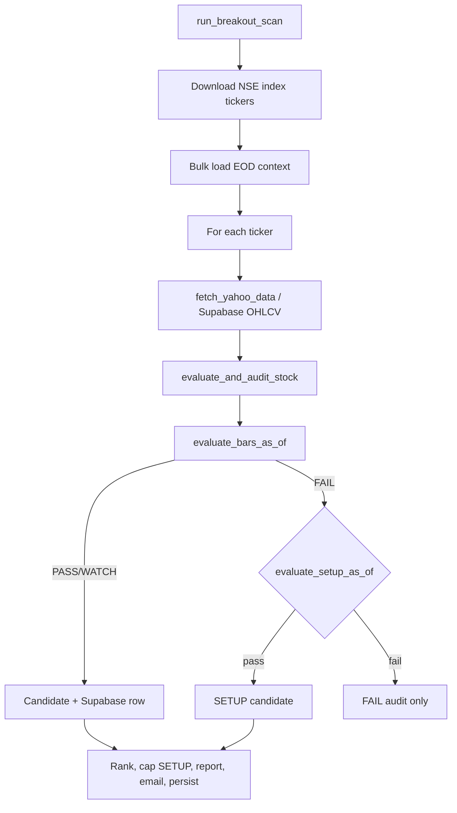

# Breakout Scanner — Complete Logic Reference

Canonical live scanner: `run_breakout_scan` in `src/breakout_scanner.py`.  
Point-in-time evaluation: `evaluate_bars_as_of`.  
Evidence layer: `src/breakout_evidence.py`.  
SETUP (PRE_BREAKOUT): `evaluate_setup_as_of` in `src/breakout_setup.py`.  
Historical replay / backtest: `src/breakout_backtest.py` (same `evaluate_bars_as_of`).

For a shorter operational summary see `docs/breakout_logic.md`.

---

## 1. Universes and tiers

| Tier key | Index | ~Count | Min price | Vol mult threshold | Liquidity gate (median turnover) | Persistence PASS min |
|----------|-------|--------|-----------|-------------------|----------------------------------|----------------------|
| `SMALL_CAP_100` | Nifty Smallcap 100 | ~100 | ₹15 | 3.5× | ≥ ₹2 cr/day | score ≥ 1 |
| `MICRO_CAP_250` | Nifty Microcap 250 | ~250 | ₹10 | 3.0× | ≥ ₹3 cr/day | score ≥ 2 |

Defined in `FILTERS` (`breakout_scanner.py`).

**Micro-only volume continuation:** if a prior session (within 2 bars) cleared the tier vol threshold, day T may pass volume at **2.5×** (`vol_continuation_prior_spike`).

---

## 2. Output tiers

| Tier | `signal_tier` | `passed` | Meaning |
|------|---------------|----------|---------|
| **PASS** | `PASS` | `true` | All waterfall + evidence gates; actionable breakout |
| **WATCH** | `WATCH` | `false` | Technical pass but quality/risk downgrade |
| **SETUP** | `PRE_BREAKOUT` | `false` | Coiling pre-breakout; alert only, no entry until trigger |
| **FAIL** | `null` | `false` | Any hard filter failure |

Report sort order: PASS → WATCH → SETUP, each by rank descending. SETUP capped at **10 per universe tier** (`SETUP_CAP_PER_TIER`).

---

## 3. Data sources

| Source | Loader | Used for |
|--------|--------|----------|
| NSE index CSVs | `INDEX_URLS` | Universe tickers (`SYMBOL.NS`) |
| Supabase `equity_ohlcv_daily` | `breakout_ohlcv_store.load_ohlcv_from_supabase` | Live + backtest OHLCV (preferred when warm) |
| Yahoo Finance | `fetch_yahoo_data` / `fetch_yahoo_history` | OHLCV fallback; backtest cache under `data/cache/breakout_yahoo/` |
| Bhav copy CSVs | `temp/nse_cache/sec_bhavdata_full_*.csv` | Turnover lacs; delivery fallback |
| Supabase `delivery_daily` | `load_delivery_pct_by_symbol` | Trailing avg delivery % |
| Supabase `shareholding_quarterly` | `load_free_float_pct_by_symbol` | Free-float % |
| Supabase `sector_priority_rankings` | `load_sector_lead_scores` | Sector leadership for composite rank |
| Supabase `breakout_stock_analysis` | `persist_breakout_stock_analysis` | Audit persistence |

**Bulk EOD context** (once per scan, before ticker loop in `run_breakout_scan`):

1. `load_bhav_turnover_lacs_by_symbol`
2. `load_delivery_pct_by_symbol`
3. `load_sector_lead_scores`
4. `load_free_float_pct_by_symbol`

Missing fields degrade gracefully: liquidity gate skipped if no turnover; sector lead defaults to 50 in rank.

---

## 4. Technical indicators (computed from OHLCV through bar T)

| Metric | Function | Window |
|--------|----------|--------|
| SMA 20 / 50 / 200 | `calculate_sma` | Simple MA of close |
| RSI 14 | `calculate_rsi` | Wilder-style |
| ADX 14 | `calculate_adx` | TR / ±DM → DX → ADX |
| Vol mult | inline | `volume[T] / SMA20(volume)[T]` |
| Vol cum mult | inline | `sum(vol last 3d) / (3 × SMA20 vol)` |
| POC | `get_volume_profile` | 30-day volume profile midpoint |
| VPR, CMF 20 | via evidence inputs | Participation scoring |

---

## 5. Breakout waterfall (`evaluate_bars_as_of`)

Filters run in sequence; first failure sets `fail_reason`. Alternate paths accumulate in `pass_paths` without bypassing hard fails.

| Step | Check | Pass | Fail reason |
|------|-------|------|-------------|
| 0 | History | ≥ 50 bars | `insufficient_data` |
| 1 | Min price | `close[T] ≥` tier min | `min_price` |
| 2 | Daily change | 3% ≤ pct ≤ 20% | `pct_change` |
| 3 | SMA50 trend | above SMA50 **or** `sma20_reclaim` | `SMA50` |
| 4 | Volume | standard, cum-3d, or micro continuation | `vol` |
| 5 | RSI | 50–70 **or** `rsi_hot` | `RSI` |
| 6 | ADX | ≥ 25 **or** `adx_soft` | `ADX` |
| 7 | Target R:R | `(target − price) / price ≥ 8%` | `target_gain` |
| 8 | Pre-signal validation | cum return ≤ 30%; ≤ 2 vol-spike days | `pre_filter_cum_return`, `pre_filter_vol_spike` |
| 9 | ADX trajectory | rising ADX T−1 vs T−10 (path-specific) | `pre_filter_*_adx_trajectory` |
| 10 | Signal cooldown | no repeat PASS within 20 sessions (unless consolidation exempt) | `pre_filter_signal_cooldown` |
| 11 | ADX-soft chase | if `adx_soft`: T−10..T−1 cum return ≤ 20% | `pre_filter_adx_soft_chase` |
| 12 | Power-gap / adx_soft tiering | may set WATCH — see §7 | — |
| 13 | Liquidity gate | median turnover ≥ tier floor | `pre_filter_liquidity` |
| 14 | Micro participation | VPR/CMF/delivery rules | `pre_filter_micro_participation` |
| 15 | v7 PASS gates | persistence min; stage ≠ 3 → WATCH | `v7_low_volume_persistence`, `v7_breakout_stage_3` |

### Threshold constants (`breakout_scanner.py`)

| Constant | Value |
|----------|-------|
| `PCT_CHANGE_MIN` | 3.0% |
| `PCT_CHANGE_MAX_NORMAL` | 12.0% |
| `PCT_CHANGE_MAX_POWER_GAP` | 20.0% |
| `ADX_HARD_FLOOR` / `ADX_SOFT_FLOOR` | 25 / 20 |
| `ADX_SOFT_VOL_BONUS` | +0.5× on tier vol thresh |
| `RSI_MIN` / `RSI_MAX_NORMAL` / `RSI_MAX_HOT` | 50 / 70 / 75 |
| `HOT_VOL_THRESHOLD` | 5.0× |
| `SMA20_RECLAIM_VOL_THRESHOLD` | 5.0× |
| `PRE_SIGNAL_CUM_RETURN_MAX` | 30% |
| `PRE_SIGNAL_VOL_SPIKE_MULT` | 2.0× |
| `PRE_SIGNAL_VOL_SPIKE_DAYS_MAX` | 2 |
| `PRE_SIGNAL_COOLDOWN_SESSIONS` | 20 |
| `PRE_SIGNAL_COOLDOWN_CONSOLIDATION_MAX` | 12% range |
| `PRE_SIGNAL_COOLDOWN_DIST_20D_HIGH_MIN` | −3% from 20d high |
| `POWER_GAP_CUM_RETURN_MAX` | 15% |
| `POWER_GAP_VOL_RECOVERY_THRESHOLD` | 5.5× |
| `STANDARD_ADX_TRAJECTORY_VOL_EXCEPTION` | 7.0× |

---

## 6. Alternate pass paths

Recorded in `pass_paths` and echoed in `risk_flags`.

| Path key | Trigger |
|----------|---------|
| `power_gap` | pct_change in (12%, 20%] |
| `vol_continuation_cum3d` | 3-session cumulative vol ≥ tier threshold |
| `vol_continuation_prior_spike` | Micro: prior spike + vol ≥ 2.5× |
| `sma20_reclaim` | Below SMA50 but ≥ SMA20 with vol ≥ 5× |
| `rsi_hot` | RSI 70–75 with vol > 5× |
| `adx_soft` | ADX 20–25, vol ≥ tier+0.5, above SMA50, positive day |

Helper functions: `_volume_filter_passes`, `_power_gap_confirmation_gate`, `_adx_trajectory_gate`, `_signal_cooldown_gate`, `_adx_soft_chase_gate`.

---

## 7. WATCH downgrades (no `fail_reason`)

| Reason code | Condition |
|-------------|-----------|
| `v6_power_gap_unconfirmed` | `power_gap` without ADX/cum-return/vol recovery |
| `v6_adx_soft_solo` | Only alternate path is `adx_soft` |
| `v7_low_volume_persistence` | `persistence_score` below tier minimum |
| `v7_breakout_stage_3` | Parabolic stretch > 4 ATR |

Set in `evaluate_bars_as_of` after evidence metrics; `passed` remains `false` for WATCH.

---

## 8. Evidence layer (`breakout_evidence.py`)

### 8.1 Liquidity gate (hard fail)

`liquidity_gate_pass(tier, median_turnover_inr)` — small ≥ ₹2 cr, micro ≥ ₹3 cr median daily. Missing turnover **skips** gate.

### 8.2 Liquidity quality (0–100, scoring)

`liquidity_quality_score` — weighted mean with renormalized weights when inputs missing:

| Component | Weight |
|-----------|--------|
| Turnover subscore | 0.35 |
| Delivery % | 0.25 |
| Volume consistency (20d CV) | 0.20 |
| Free-float % | 0.20 |

### 8.3 Micro-cap participation (hard fail when `False`)

`micro_cap_participation_pass` — tier VPR/CMF/delivery floors:

| Tier | VPR min | CMF min | Delivery min |
|------|---------|---------|--------------|
| Small | > 1.5 | > 0.0 | — |
| Micro | > 2.0 | > 0.05 | > 40% |

### 8.4 Volume persistence (0–4)

`volume_persistence_score` — count of last 10 sessions with vol > 1.5× 20d avg: 0→0, 1→1, 2→2, 3+→4.

Minimum for PASS: `persistence_pass_min(tier)` — small ≥ 1, micro ≥ 2.

### 8.5 Breakout stage

| Stage | Label | Rule |
|-------|-------|------|
| 1 | Fresh | Near 52w high (≥97%), base > 30d, stretch < 2 ATR |
| 2 | Young | Breakout age < 20 sessions |
| 3 | Parabolic | Stretch > 4 ATR above SMA50 → WATCH downgrade |

### 8.6 Base quality (0–100)

Compression (0.40) + tight base (0.30) + pivot proximity (0.30).

### 8.7 Composite rank (PASS/WATCH candidates)

`composite_rank_score(metrics, sector_lead)`:

| Factor | Weight |
|--------|--------|
| Breakout (vol + pct) | 0.25 |
| Sector lead | 0.20 |
| Base | 0.15 |
| Vol persistence | 0.15 |
| Acceleration (ADX delta + pct) | 0.10 |
| RS (RSI mapped) | 0.10 |
| Risk penalty (stage 3, power_gap) | 0.05 |

---

## 9. SETUP tier (`evaluate_setup_as_of`)

Evaluated in `evaluate_and_audit_stock` when breakout waterfall fails and tier is not already PASS/WATCH.

### Gates (all must pass)

| Check | Small cap | Micro cap |
|-------|-----------|-----------|
| pct_change | −2.0% .. 2.9% | same |
| vol_mult | 1.5× .. 2.5× | 1.5× .. 2.3× |
| base_score | ≥ 58 | ≥ 58 |
| consolidation_days | ≥ 18 | ≥ 18 |
| pivot_proximity | ≥ 85 | ≥ 85 |
| 52w high ratio | ≥ 0.92 | ≥ 0.92 |
| stretch_atr | < 2.5 | < 2.5 |
| RSI | 45 .. 68 | 45 .. 68 |
| ADX | 18 .. 32 | 18 .. 32 |
| persistence | ≥ 1 | ≥ 1 |
| pre_signal cum return | ≤ 35% | ≤ 35% |
| liquidity gate | pass | pass |
| breakout_stage | ≠ 3 | ≠ 3 |
| trend | ≥ SMA50 or SMA20 reclaim w/ vol | same |

### SETUP outputs

- `setup_trigger_price` — 30d consolidation high
- `setup_rank` — `setup_rank_score` (base 30%, persistence 20%, sector 15%, pivot 15%, liquidity 10%, RS 10%)
- `risk_flags`: *"SETUP — alert only. No position until trigger. Max 0.5% probe after trigger confirms PASS."*
- Trigger to PASS: price crosses trigger with ≥3% day and tier vol threshold (`setup_trigger_pct_min` / `setup_trigger_vol_mult`)

Capped at top 10 SETUP rows per tier in report via `_cap_setup_per_tier`.

---

## 10. Trade levels (signal day T)

| Field | Formula |
|-------|---------|
| Stop-loss | `min(SMA50, POC) × 0.98` |
| Target | `price + 2 × (price − stop)` (1:2 R:R) |
| Entry low | `price × 0.985` |
| Entry high | `price × 1.01` |

Target gain must be ≥ 8% for waterfall step 7.

---

## 11. Scan orchestration flow



Key functions:

- `run_breakout_scan` — main entry
- `evaluate_and_audit_stock` — per-ticker wrapper, SETUP fallback
- `evaluate_bars_as_of` — breakout waterfall + evidence + tier
- `evaluate_setup_as_of` — PRE_BREAKOUT path
- `compute_evidence_metrics` — evidence bundle
- `persist_breakout_stock_analysis` — Supabase audit

---

## 12. Backtest vs live differences

| Aspect | Live scan | Backtest / reconcile |
|--------|-----------|----------------------|
| OHLCV | Supabase preferred, Yahoo fallback + day cache | Yahoo 6m cache or Supabase when `prefer_supabase` |
| EOD context | Loaded once per scan date | Loaded per replay date in reconcile |
| Cooldown | `last_pass_idx` tracked in scan loop | Reconcile tracks `last_pass_idx` across history |
| SETUP | Full pipeline + report cap | Backtest typically PASS-only signals; reconcile omits SETUP |
| Rate limits | 120s sleep every 50 tickers | Throttled fetch in `fetch_universe_history_throttled` |
| Forward validation | N/A live | `validate_forward_path` — T+5/10/15 stop/target path |
| Branch | Production workflow branch | Local feature branch may diverge from GHA `main` |

Forward validation (`breakout_backtest.validate_forward_path`):

- Entry at signal-day close (`latest_price`)
- Stop: `sl_price`, target: `target_price`
- Horizons: T+5, T+10, T+15
- Metrics: target hit rate, MFE ≥8%/15%, close return ≥8%/15%, stop-out rate

---

## 13. Persistence schema (`breakout_stock_analysis`)

Key columns written by `_build_stock_analysis_record` / `persist_breakout_stock_analysis`:

- Core: `scan_date`, `run_id`, `ticker`, `tier`, `passed`, `fail_reason`, `signal_tier`
- v7: `persistence_score`, `composite_rank`, `liquidity_quality`, `breakout_stage`, `base_score`, `pass_paths`, `risk_flags`
- Levels: `entry_low`, `entry_high`, `stop_loss`, `target_price`
- SETUP: `setup_trigger_price`, `setup_rank`
- Context: `pct_change`, `vol_mult`, `rsi_14`, `adx_14`, `breeze_stock_code`

---

## 14. How to run

```bash
# Live scan
export PYTHONPATH=src
python -m src.breakout_scanner

# Full-universe backtest (3 months)
python scripts/breakout_backtest.py --range 3m --full-universe

# Old vs new Supabase reconciliation
python scripts/reconcile_breakout_efficacy.py --output-stem old_vs_new_3m_comparison
```

Outputs:

| Artifact | Path |
|----------|------|
| Daily report | `output/breakouts/daily_breakout_report_v2.md` |
| Backtest report | `output/breakoutcheck/full_universe/breakout_backtest_report.md` |
| Reconciliation | `output/breakoutcheck/old_vs_new_3m_comparison.md` |

---

## 15. Related modules

| Module | Role |
|--------|------|
| `src/breakout_scanner.py` | Orchestration, waterfall, reporting |
| `src/breakout_evidence.py` | Liquidity, persistence, stage, rank |
| `src/breakout_setup.py` | PRE_BREAKOUT evaluation |
| `src/breakout_eod_context.py` | Bhav turnover, delivery, free float |
| `src/breakout_sector_context.py` | Sector leadership scores |
| `src/breakout_ohlcv_store.py` | Supabase OHLCV read |
| `src/breakout_store.py` | Supabase analysis persistence |
| `src/breakout_backtest.py` | Historical replay + forward validation |
| `scripts/reconcile_breakout_efficacy.py` | Supabase old vs replay new |

*Educational reference only; not investment advice.*
