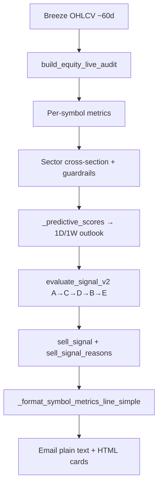

# Stock Analysis Email — Metrics Reference

This document describes **every metric shown in Titan sector digest emails** (the per-symbol card layout under `--- Per-symbol metrics ---`). It is written for readers who want to understand what each number means, how it is calculated, and how it feeds action labels (BUY / HOLD / TRIM / EXIT RISK).

**Primary code paths**

| Role | File | Key functions |
|------|------|---------------|
| Metric computation | `src/titan_engine.py` | `calculate_*` helpers |
| Audit assembly & guardrails | `src/sector_audit.py` | `build_equity_live_audit`, `_predictive_scores`, `_apply_sector_cross_section` |
| Email text formatting | `src/sector_audit.py` | `_format_symbol_metrics_line_simple` |
| Email HTML rendering | `src/email_notify.py` | `_html_per_symbol_sector_cards` |
| Action / risk engine | `src/signal_v2.py` | `evaluate_signal_v2` (layers A–E) |
| Action labels & colors | `src/action_signals.py` | `action_signal_plain_english`, `derive_action_signal` |

**Data conventions**

- Price/volume metrics use daily OHLCV from Breeze, fetched with a default **60 calendar-day** lookback (`fetch_equity_data` in `src/breeze_client.py`). Each metric then uses its own rolling window, clipped to available rows (no look-ahead).
- Returns are close-to-close **percent** values (e.g. `-2.0` = −2%).
- `NaN` means the metric could not be computed (missing data, insufficient history, etc.).

**Emoji legend (digest display only)**

| Emoji | Meaning in email |
|-------|------------------|
| 🟢⬆ | Bullish vs configured threshold bands |
| 🔴⬇ | Bearish vs configured threshold bands |
| 🟡➡ | Neutral / unavailable / in-between |
| 🟠➡ | Caution (used for extended EMA200 distance) |

Icons are **display helpers** in `_metric_icon`, `_ema200_distance_icon`, etc. (`src/sector_audit.py`). They do not directly change scores.

---

## Metric inventory

| Short name | Full name | Emoji / status |
|------------|-----------|----------------|
| Trend regime (14D) | ADX + DI trend classification | 🟢 Buy / 🔴 Sell / 🟡 Sideways |
| 20D Range Position | Distance to 20-day high/low | 🟢 near-high / 🔴 near-low / 🟡 mid-range |
| EMA200 distance | Distance above long-term trend (EMA200) | 🟢 / 🟡 / 🟠 / 🔴 by stretch bands |
| CMF20 | 20D Chaikin Money Flow | 🟢 accumulation / 🔴 distribution / 🟡 neutral |
| Volume participation | Today vs recent average volume | 🟢 high / 🔴 thin / 🟡 average |
| Intent percentile | Effective intent vs sector peers | 🟢 leader / 🔴 laggard / 🟡 average |
| 1W outlook percentile | Next-week score vs sector peers | 🟢 leader / 🔴 laggard / 🟡 average |
| 1D move (EOD) | Last complete close-to-close return | 🟢 ≥+1% / 🔴 ≤−1% / 🟡 muted |
| Session move (live) | Intraday vs previous close (quote) | same bands; display only |
| 1D z-score (20D window) | Fast rolling z-score of close (20 sessions) | 🟢 ≥+1 / 🔴 ≤−1 / 🟡 near mean |
| 1D z-score (60D window) | Slow rolling z-score (~60 sessions; when history ≥45 bars) | same bands |
| 1D z-score (blend, scoring) | 55% fast + 45% slow (or fast-only when &lt;45 bars); drives intent / Layer C | same bands |
| ATR14 % | Typical daily swing as % of price | 🟢 calm / 🔴 elevated / 🟡 moderate |
| ATR14 / ATR63 | Volatility vs ~3-month baseline | 🟢 low / 🔴 high / 🟡 normal |
| Technical intent | Equity technical composite (0–100) | 🟢 ≥55 / 🔴 ≤45 / 🟡 neutral |
| 1W outlook | Next-week heuristic score (0–100) | 🟢 ≥55 / 🔴 ≤45 / 🟡 neutral |
| 1D outlook | Next-day heuristic score (0–100) | same bands as 1W |
| Action headline | BUY / HOLD / TRIM / EXIT RISK | Color-coded card border |
| Why this action | Top signal-engine reasons | Text only |
| Model read confidence | Heuristic confidence from 1W outlook | high / medium / low |
| tapeBlend | Technical composite term in 1W breakdown | Named driver in confidence line |
| Macro fallback | News correlation when stock news missing | tailwind / headwind / neutral |

---

## Per-metric reference

### 1. Trend regime (14D) — ADX, +DI, −DI, strength bands

**What it measures:** Whether the stock is in a directional trend or trading sideways, and which direction dominates when trend strength is sufficient.

**Calculation**

- **ADX (14):** `calculate_adx(df, window=14)` — `src/titan_engine.py`
  - True Range → +DM / −DM → rolling sums → +DI, −DI → DX → ADX (simple rolling mean, Wilder-style approximation).
- **+DI / −DI (14):** `calculate_latest_di(df, window=14)` — latest non-NaN directional indicators.
- **Regime label:** `_trend_regime_label(adx, plus_di, minus_di)` — `src/sector_audit.py`
  - ADX &lt; 20 → **Sideways** (direction ignored).
  - ADX ≥ 20 and +DI &gt; −DI → **Buy trend**.
  - ADX ≥ 20 and −DI &gt; +DI → **Sell trend**.
- **Strength band text:** `_adx_strength_band(adx)` — weak (&lt;20), building (20–25), strong (≥25).

**Lookback:** 14 sessions for ADX/DI; OHLC pulled from ~60 calendar days of history.

**Email threshold bands**

| ADX | Label in email |
|-----|----------------|
| &lt; 20 | Sideways; strength “weak (&lt;20)” |
| 20–24 | Directional if DI split; strength “building (20–25)” |
| ≥ 25 | Directional; strength “strong (≥25)” |

**Role in analysis**

- **Layer D (signal engine):** ADX &lt; 20 up-weights mean-reversion (CMF, over-extension); ADX ≥ 25 up-weights momentum (`layer_d` in `src/signal_v2.py`).
- **Tier-2 corroborator:** “weak ADX with −DI dominance” when ADX &lt; 20 and −DI &gt; +DI.

**Criticality:** **Medium** — shapes weighting and one Tier-2 disqualifier; digest display is contextual, not a direct score input.

---

### 2. 20D Range Position

**What it measures:** Where the latest close sits within the recent 20-session high–low range.

**Calculation:** `calculate_breakout_20d_distances_pct(df)` — `src/titan_engine.py`

```
win = min(20, len(closes))
high_20 = max(close[-win:])
low_20  = min(close[-win:])
pct_to_high   = (close_last / high_20 - 1) * 100    # negative = below high
pct_above_low = (close_last / low_20 - 1) * 100    # positive = above low
```

Stored as `breakout_20d_distance_pct_to_high` and `breakout_20d_distance_pct_above_low`.

**Lookback:** 20 sessions.

**Email threshold bands** (`_range_position_context`, `_breakout_state_icon`)

| Condition | Context text | Icon |
|-----------|--------------|------|
| pct_to_high ≥ −1% | near-high (within ~1% of 20D high) | 🟢 |
| pct_above_low ≤ 1% | near-low (within ~1% of 20D low) | 🔴 |
| otherwise | inside 20D range | 🟡 |

**Role in analysis:** **Display-only** in the current email digest. Not consumed by `signal_v2` scoring (unlike EMA200 stretch).

**Criticality:** **Low** for actions; **Medium** for human context (extension / compression within recent range).

---

### 3. Distance above long-term trend (EMA200)

**What it measures:** How far price sits above or below its 200-day exponential moving average, in percent.

**Calculation**

- EMA200: `calculate_ema(close, span=200)` — pandas `ewm(span=200, adjust=False)`.
- Distance: `ema_200_distance_pct = (close_last / ema_200 - 1) * 100` — `build_equity_live_audit`.

**Lookback:** EMA uses full available close history (up to ~60 calendar days fetched; confidence down-weighted when &lt; 200 sessions via `_ema_history_confidence`).

**Email threshold bands** (`_ema200_distance_icon`, `_ema200_distance_bands_text`)

| Distance % | Icon | Meaning |
|------------|------|---------|
| ≤ −5% | 🔴 | Below trend |
| −5% to 0 | 🟡 | Near / slightly below trend |
| 0 to 10% | 🟢 | Healthy above trend |
| 10–15% | 🟡 | Moderately extended |
| 15–25% | 🟠 | Extended |
| &gt; 25% | 🔴 | Very extended |

**Role in analysis**

- **Predictive scores:** `ema_200_distance_pct * 0.26 * ema_conf` contributes to 1D/1W outlook (`_predictive_scores`).
- **Layer C (bearish):** Below-EMA ramp adds risk when distance &lt; −2% → −6%.
- **Layer D:** Healthy-pullback rescue requires `ema_200_distance_pct >= 0`.
- **Related (not in email headline):** `ema200_stretch_atr = ema_200_distance_pct / atr_14_pct` drives over-extension risk in Layer C-8.

**Criticality:** **High** — trend context for outlook scores and bearish trend-family risk.

---

### 4. 20D Money Flow / Money flow trend (CMF)

**What it measures:** Whether volume-backed buying or selling pressure dominated over the last 20 sessions (Chaikin Money Flow).

**Calculation:** `calculate_cmf(df, window=20)` — `src/titan_engine.py`

```
MFM = ((close - low) - (high - close)) / (high - low)   # in [-1, +1]
MFV = MFM * volume
CMF = sum(MFV, 20) / sum(volume, 20)
```

**CMF delta (Context section, when shown):** prior-day CMF vs today via `_cmf_delta_payload` / `_cmf_delta_interpretation`.

**Lookback:** 20 sessions.

**Dual-row display (open session, incomplete bar):** When the cash session is open and today’s bar is incomplete, the digest shows an **EOD** row from `cmf_20` on `metrics_df` (last complete bar) and a **live** row from `session_cmf_20` (CMF on `sorted_df` including today’s partial bar, with last-bar close patched from the live quote). Live rows require `price_snapshot_ts`. Band legend appears once after both rows. Scoring and signal v2 still use EOD `cmf_20` only.

**Email threshold bands** (`_cmf_band`)

| CMF | Band | Icon |
|-----|------|------|
| &gt; 0.05 | accumulation | 🟢 |
| −0.05 to 0.05 | neutral | 🟡 |
| &lt; −0.05 | distribution | 🔴 |

**Role in analysis**

- **Layer C-7:** Bear/bull ramps outside ±0.05 dead-band; OBV slope amplifies same-sign flow ×1.25.
- **Layer D:** “Hollow breakout” if `ret1d > 2%` and `cmf < -0.05`.
- **Tier-2:** `cmf < -0.05` counts as “cmf distribution” corroborator.
- **BUY gate:** Requires `cmf >= -0.05` (or NaN).

**Criticality:** **High** — direct scoring, tier corroboration, and buy gate.

**Fallback:** If CMF unavailable, digest may show **OBV slope** as proxy (`_cmf_or_obv_for_digest`).

---

### 5. Volume participation

**What it measures:** Whether today’s traded volume is high or low compared with recent sessions (not delivery or FII/DII flow).

**Raw calculation:** `volume_participation_ratio(df)` — `src/breeze_client.py`

```
current = volume[-1]
avg = mean(volume[-6:-1])   # prior 5 sessions, excluding today
ratio = current / avg
```

**Scoring input (used in intent):** `_calibrate_volume_participation_v2` caps raw ratio (default cap 2.5), then `_normalize_participation_for_scoring` log-compresses to ~0–3. Intent and signal v2 use the calibrated EOD path only.

**Dual-row display (open session, incomplete bar):** **EOD** row shows raw `volume_participation_ratio` from `metrics_df`. **Live** row shows `session_volume_participation_ratio` (partial today volume from `sorted_df` ÷ mean of the last 5 complete sessions on `metrics_df`). Live rows require `price_snapshot_ts`. Band legend appears once after both rows.

**Lookback:** 5 prior sessions for denominator; stress proxies use **raw** `volume_participation_ratio`.

**Email threshold bands** (`_volume_participation_label`)

| Value | Label |
|-------|-------|
| ≥ 1.5 | high participation |
| 1.0–1.49 | above average |
| 0.7–0.99 | below average |
| &lt; 0.7 | thin participation |

**Role in analysis**

- **Technical intent:** 48% weight via `calculate_equity_technical_score`.
- **Stress proxies (raw VPR):** `high_volume_down_day_proxy` (down day + VPR ≥ 1.5); `trap_exit_proxy` (up day + VPR ≤ 0.5).
- **Tier-2:** VPR-derived proxies count as **one** corroborator (de-duplicated).
- **Layer D:** Healthy-pullback uses raw VPR &lt; 1.0.

**Criticality:** **High** — core intent input and several stress/tier rules.

---

### 6. Intent score — percentile among sector peers

**What it measures:** Where the stock’s **effective intent score** ranks within the same sector cohort (0 = lowest peer, 100 = highest).

**Underlying score (Technical intent):** See §12.

**Percentile calculation:** `percentile_rank_0_100(values, x)` — `src/tape_metrics.py`; assigned in `_apply_sector_cross_section` as `sector_pctile_effective_intent`.

**Lookback:** Cross-section is **same run, same sector** (requires ≥2 successful symbols for meaningful ranks).

**Email threshold bands** (`_sector_rank_band`)

| Percentile | Band |
|------------|------|
| ≥ 67 | leader |
| 34–66 | average |
| ≤ 33 | laggard |

**Role in analysis:** **Display / relative context** in email. Engine uses absolute `effective_intent_score`, not the percentile.

**Criticality:** **Low** for automated actions; **Medium** for peer comparison in the email.

---

### 7. 1W outlook — percentile among sector peers

**What it measures:** Sector-relative rank of `next_week_score` (`sector_pctile_next_week_score`).

**Calculation:** Same percentile mechanism as §6; assigned after final `_refresh_symbol_scoring_outputs`.

**Email bands:** Same leader / average / laggard thresholds (≥67 / 34–66 / ≤33).

**Role in analysis:** Display only; engine uses absolute `next_week_score` (e.g. BUY gate ≥ 70).

**Criticality:** **Low** for actions; **Medium** for email context.

---

### 8. 1D move (EOD) and Session move (live)

The digest shows **two distinct price-change metrics** when the cash session is open and a live quote is available.

#### 8a. 1D move (EOD)

**What it measures:** Close-to-close percentage change from the **last complete daily bar** (prior session when today's bar is still forming).

**Calculation:** `return_1d_pct = (close_last / close_prev - 1) * 100` on the metrics OHLC frame — `build_equity_live_audit` after `_prepare_ohlc_for_metrics`.

**As-of date:** `ohlc_bar_as_of_date` (ISO date of the last complete bar used for EOD metrics).

**During market hours:** If the latest OHLC row is today's incomplete session, EOD metrics exclude that row; `ohlc_bar_incomplete` is set on the audit payload.

**Lookback:** 2 complete sessions.

**Email format:** `1D move (EOD): {pct}% · as of {YYYY-MM-DD}`

**Email bands:** ≥ +1% strong up; −1% to +1% muted; ≤ −1% weak.

**Role in analysis**

- Momentum family in Layer C (ramps on negative returns).
- Tier-1 structural exit when combined with structural break and `ret1d <= -8%`.
- `extreme_price_move_proxy` if |ret1d| ≥ 18% (dampens 1D term in outlook scores).
- **Scoring uses EOD only** — session move does not feed signal v2 in v1.

**Criticality:** **High**.

#### 8b. Session move (live) — display only

**What it measures:** Intraday move vs **previous close** from Breeze `get_quotes` while the cash session is open.

**Calculation:** Prefer `ltp_percent_change` when it aligns with `(ltp / previous_close - 1) * 100`; otherwise compute from LTP and previous close — `fetch_equity_quote`, `_session_move_from_quote`.

**As-of time:** `price_snapshot_ts` from quote `ltt`, shown as `HH:MM IST`.

**Email format:** `Session move (live): {pct}% · as of {HH:MM IST}` (only when session open and quote available).

**Role in analysis:** **Display only in v1** — not wired into BUY/HOLD/TRIM scoring.

**Criticality:** **Low** for automated actions; **High** for human intraday context.

---

### 9. 1D z-score

**What it measures:** How many standard deviations today’s close is from its recent mean — shown as three digest rows (20D window, optional 60D window, blend for scoring).

**Calculation**

1. Base: `calculate_z_score(close, window)` — population std, `src/titan_engine.py`.
2. Blend: `_blend_equity_z_score` — `src/sector_audit.py`
   - Always compute 20d (or max available) `z_score_fast_20`.
   - If &lt; 45 sessions: use z_fast only (`z_score_blend = "20d_only"`); `z_score_slow` is NaN and the 60D email row is omitted.
   - Else: `z_score = 0.55 * z_fast + 0.45 * z_slow` with slow window ≈ 60 sessions (`z_score_slow`).

**Lookback:** 20d fast; up to ~60d slow when history allows.

**Email format** (`_format_symbol_metrics_line_simple`, `▸ 1D / Tape`):

```
🟢⬆ 1D z-score (20D window): +2.10 (strong bullish deviation) · as of 2026-06-06
🟢⬆ 1D z-score (60D window): +1.40 (bullish deviation) · as of 2026-06-06   # omitted when history <45 bars
   Z bands: >=+2 strong bullish, +1 to +2 bullish, -1 to +1 near mean, -2 to -1 bearish, <=-2 strong bearish
🟢⬆ 1D z-score (blend, scoring): +1.80 (bullish deviation) · as of 2026-06-06
```

**Email labels** (`_z_label`): ≥+2 strong bullish; +1 to +2 bullish; −1 to +1 near mean; −2 to −1 bearish; ≤−2 strong bearish.

**Role in analysis**

- **Scoring uses blend only:** `z_score` (not the individual window rows).
- **Technical intent:** 52% weight after tanh normalization.
- **Layer C:** Downside-only z ramp (−1 → −2 adds up to 2 risk points).

**Criticality:** **High**.

---

### 10. Typical daily swing (ATR14)

**What it measures:** Average true range over 14 sessions, expressed as **percent of price** (`atr_14_pct`).

**Calculation**

- `atr_14 = calculate_atr(df, 14)` — SMA of true range.
- `atr_14_pct = (atr_14 / close_last) * 100`.

**Lookback:** 14 sessions.

**Email bands:** &lt; 2.0% calm; 2.0–4.0% moderate; &gt; 4.0% elevated.

**Role in analysis**

- Fallback volatility input when sector-relative `atr_penalty_input` unavailable.
- Layer C volatility ramp (4% → 6% ATR%).
- Outlook scores: ATR penalty subtracts from 1D/1W scores.

**Criticality:** **Medium**–**High** (volatility family + outlook).

---

### 11. Volatility vs 3M baseline

**What it measures:** Whether short-term volatility is expanded or compressed vs a longer baseline.

**Calculation:** `atr_14_over_atr_63 = calculate_atr_ratio(df, 14, 63)` — ratio of 14-day ATR to 63-day ATR.

**Lookback:** 14 and 63 sessions.

**Email bands** (`_atr_ratio_band`): &lt; 0.90 low; 0.90–1.10 normal; &gt; 1.10 high.

**Role in analysis:** **Display-only** in email; sector-relative `atr_penalty_input` is preferred in the signal engine.

**Criticality:** **Low** for actions; **Medium** for human volatility context.

---

### 12. Technical intent score

**What it measures:** Composite “tape conviction” for cash equities (0–100), combining z-score and volume participation.

**Calculation:** `calculate_equity_technical_score(z, participation_for_scoring)` — `src/titan_engine.py`

```
norm_z = clamp01(0.5 + 0.5 * tanh(z / 3))
norm_p = clamp01(p / 3)          # p = calibrated participation input
score  = 100 * (0.52 * norm_z + 0.48 * norm_p)
```

Initial assignment: `intent_score = effective_intent_score = score`.

**Mutations before signal engine**

| Guardrail | Effect |
|-----------|--------|
| Cluster (`_apply_cluster_guardrails`) | Cap to min(intent, 50) when &gt;70% of sector ≤ −1% day |
| Macro (`_apply_macro_guardrails`) | ×0.5 when GIFT Nifty &lt; −0.5% or India VIX &gt; 18 |
| Event (`_apply_event_guardrails`) | ×0.85 when event within ~3 sessions |

**Email labels** (`_equity_technical_label`): ≥70 high conviction long; 55–69 moderate long; 45–54 neutral; 30–44 defensive; &lt;30 high defensive.

**Role in analysis**

- Feeds `_predictive_scores` as `tech_composite_term` (tapeBlend).
- Layer C intent ramp; BUY gate requires ≥ 65.
- Displayed as “Technical intent” in email.

**Criticality:** **High**.

---

### 13. 1W outlook score

**What it measures:** Heuristic forward-leaning score (0–100, baseline 50) for the ~one-week horizon.

**Calculation:** `_predictive_scores` — `src/sector_audit.py`

```
tech_week = (effective_intent - 50) * 0.62
next_week = 50 + tech_week + 0.78*ret1d_term + 0.82*ret5d_term + 0.48*ret10d_term
            + 0.72*rel5_term + 0.5*rel20_term + ema_week - 0.35*atr_penalty
            - event/trap/stress penalties
```

**Lookback:** Uses 1/5/10/20-day returns, Nifty-relative returns, EMA distance, ATR penalty — see `prediction_breakdown.week`.

**Email bands** (`_horizon_score_label`): ≥70 strong constructive; 55–69 moderate; 45–54 neutral; 35–44 caution; &lt;35 defensive.

**Role in analysis**

- Layer C horizon ramp (55 → 45 adds bearish points).
- BUY gate: `next_week_score >= 70`.
- Drives “Model read confidence” (§16).

**Criticality:** **High**.

---

### 14. Very short horizon (1D outlook)

**What it measures:** Same family as 1W outlook but tuned for the next session (`next_day_score`).

**Calculation:** `_predictive_scores` day branch — higher weight on 1D return term (0.42 vs 0.18 when extreme-move proxy off), full ATR penalty (not ×0.35).

**Email bands:** Same as 1W outlook.

**Role in analysis:** Shown for context; **1W outlook** is the primary horizon input for Layer C and BUY gate. 1D score is tracked for reconcile accuracy in `analysis_store`.

**Criticality:** **Medium** (display + reconciliation); lower than 1W for actions.

---

### 15. Why this action / Tier-2 corroborators / trim logic

**What it measures:** Human-readable explanation for the action headline (BUY / HOLD / TRIM / EXIT RISK).

**Source:** `sell_signal_reasons` from `evaluate_signal_v2` — up to **8** reasons (`src/signal_v2.py`). Email shows first **3** joined (`_format_symbol_metrics_line_simple`).

**Action mapping (Layer E)**

| risk_net | Gate | Label |
|----------|------|-------|
| ≥ 7 | — | exit-risk |
| ≥ 4 | — | trim |
| &lt; 4 | clean_buy | buy |
| &lt; 4 | constructive_core | accumulate |
| otherwise | — | hold |

`risk_net = clamp(risk_c - 0.5 * bull_c, 0, 10)`.

**Tier-1 (instant exit-risk, bypasses hysteresis)**

- Structural break + (`ret1d <= -8%` OR `gap_down_proxy`).
- Hard liquidity collapse (thin proxy + median notional below floor, default ₹12 lakh).

**Tier-2 corroborators** (distinct bearish signals counted in `layer_b`)

| Signal | Condition |
|--------|-----------|
| vpr-proxy stress | trap_exit OR high_volume_down_day OR panic_absorption (one vote) |
| cmf distribution | cmf &lt; −0.05 |
| over-extension hot | ema200_stretch_atr ≥ dead-band (4 ATR-% units) |
| weak ADX + −DI dominance | adx &lt; 20 and −DI &gt; +DI |
| event risk | event_risk_soon OR event_guardrail_applied |
| stale-flow downgrade | Layer D stale-flow rule |

**Trim / exit from Tier-2**

- ≥ **3** corroborators → **exit-risk** (default `TITAN_SIGV2_B_TIER2_EXIT_COUNT=3`).
- ≥ **2** corroborators **or** stale-flow downgrade → **trim** (default `TITAN_SIGV2_B_TIER2_TRIM_COUNT=2`).

Tier-2 can **escalate** the Layer E label but never downgrade it.

**Criticality:** **High** — this is the user-facing action rationale.

---

### 16. Model read confidence / tapeBlend

**What it measures:** A **digest-only** read on how confident the heuristic 1W outlook appears — **not** the same as `signal_confidence` from the v2 engine.

**Model read confidence** (`_prediction_brief_line`)

- Derived from `next_week_score`: ≥70 high; 55–69 medium; &lt;55 low.
- Downgraded one notch if outlook penalties present (trap, high-volume down-day, event risk).
- Lists top supportive/dragging factor from breakdown contributors.

**tapeBlend** = `prediction_breakdown.week.tech_composite_term` = `(effective_intent - 50) * 0.62`.

This is the technical-intent contribution to the 1W outlook, **not** a separate model. The name appears when that term is among the largest drivers (|term| ≥ 1.0).

**Other breakdown contributors (verbose / confidence line)**

| Name | Source field |
|------|--------------|
| trend | `ema_term` |
| momentum1d | `ret1d_term` |
| momentum5d | `ret5d_term` |
| vsNifty5d | `rel5_term` |
| volatility | negative `atr_penalty` |

**signal_confidence (engine, not always in email body):** `0.4 + 0.1 * n` × Layer-A seed, capped; bearish labels count corroborators in `n` (`_confidence` in `src/signal_v2.py`).

**Criticality:** **Medium** — explanatory; does not override action label.

---

### 17. Macro fallback context fields

**What it measures:** When stock-specific news is missing or correlation fails, how global/sector macro news relates to the symbol’s technical picture.

**Formatting:** `_news_correlation_line` — `src/sector_audit.py`  
**Population:** `_apply_global_news_correlation` — builds `audit["news_correlation"]`.

**Macro fallback line fields**

| Field | Meaning |
|-------|---------|
| macro_driver | Headline driver (e.g. global macro flow) |
| theme | Affected theme (sector key or “global macro”) |
| affected_metric | Inferred metric most aligned (`_infer_news_affected_metric`) |
| direction | tailwind / headwind / neutral |
| confidence | 0–1; bands ≥0.75 high, 0.50–0.74 medium, &lt;0.50 low |
| fallback_reason | Why stock news was not used |
| stock_news_fetched_count | Count of stock headlines fetched |
| coverage | e.g. not_covered, empty, helper_unavailable |

**Fallback triggers:** No stock news, correlator error, or `fallback_label` set (e.g. `macro_only_fallback`).

**Criticality:** **Low** for action labels (informational context in ▸ Context section).

---

## Additional metrics (email Context section)

These may appear under **▸ Context** but not in the main numbered list above:

| Metric | Purpose |
|--------|---------|
| CMF20 delta | Day-over-day CMF change + interpretation |
| Context flags | cluster breadth, macro throttle, event risk, volume stress |
| Fundamentals | ROE/ROCE/debt/margin assessment when available |
| News evidence | Headline snippets when stock news exists |
| signal_confidence | Written to audit; may appear in verbose digest mode |

---

## Overall analysis logic

### End-to-end flow



### How metrics feed scores and actions

1. **Technical intent** combines z-score + volume participation → may be reduced by cluster/macro/event guardrails → **`effective_intent_score`**.
2. **1D / 1W outlook** add momentum, relative strength vs Nifty, EMA distance (history-confidence-weighted), and subtract ATR penalty and stress flags.
3. **Signal v2** aggregates bearish evidence (Layer C), applies ADX/divergence/pullback modifiers (Layer D), computes **`risk_net`**, maps to a base label, then applies Tier-1/Tier-2 overrides (Layer B).
4. **BUY** requires `risk_net < 4` plus strict gate: `next_week >= 70`, `effective_intent >= 65`, flow OK, not over-extended, plus Layer-A buy_allowed.

### Weighting summary

| Component | Weight / note |
|-----------|---------------|
| Intent: z vs participation | 52% / 48% |
| Z blend (when ≥45 sessions) | 55% 20d + 45% slow |
| 1W outlook: tech composite | `(intent - 50) * 0.62` |
| Bull vs bear in risk_net | bull evidence offsets at **0.5×** |
| Layer D ADX weak | money-flow & over-ext ×1.3; momentum ×0.7 |
| Layer D ADX strong | inverse (momentum ×1.3) |

### Tier system summary

| Tier | Mechanism | Outcome |
|------|-----------|---------|
| **Tier-1** | Single catastrophic signal | Force **exit-risk**, skip hysteresis |
| **Tier-2** | Count distinct bearish corroborators | ≥3 → exit-risk; ≥2 (or stale-flow) → trim |
| **Layer E** | Continuous `risk_net` | buy / accumulate / hold / trim / exit-risk |

### Tape blend, model confidence, macro fallback

- **tapeBlend** is the technical-intent term inside the 1W outlook decomposition — the primary bridge between intent and horizon scores.
- **Model read confidence** is a simplified read of 1W outlook level ± penalties — educational, not probabilistic calibration.
- **Macro fallback** fills the news correlation block when stock-level news cannot be matched; it does not change technical scores directly.

### Email vs engine gaps (known)

| Topic | Note |
|-------|------|
| Hysteresis | Defined in Layer E but **inactive in production** — `prev_action_signal` is not populated outside backtests. |
| Session move | Live quote metric; **not** used in signal scoring (v1). |
| CMF / VPR live rows | Display-only (`session_cmf_20`, `session_volume_participation_ratio`); scoring uses EOD fields. |
| EOD as-of | Email subject/footer may include earliest `ohlc_bar_as_of_date` across symbols. |
| Volume participation in email | Digest shows **raw** `volume_participation_ratio` (EOD) and `session_volume_participation_ratio` (live); scoring still uses calibrated EOD input. |
| 20D range / ATR ratio | Display-only; not in v2 CORE_METRICS. |
| ADX smoothing | Simple rolling sums/means, not classic Wilder EMA. |
| Accumulate label | Collapses to HOLD unless `TITAN_SIGV2_ENABLE_ACCUMULATE` is set. |

---

## Related documentation

- [`docs/signal_v2_metrics_and_waterfall.md`](signal_v2_metrics_and_waterfall.md) — Full v2 engine formula reference with line citations.
- [`docs/TITAN_FRAMEWORK_DEEP_DIVE.md`](TITAN_FRAMEWORK_DEEP_DIVE.md) — System architecture and runtime modes.

---

*Generated from codebase on branch `issues`. Metrics reflect `src/sector_audit.py` digest format as exercised in `tests/test_email_notify.py`.*
